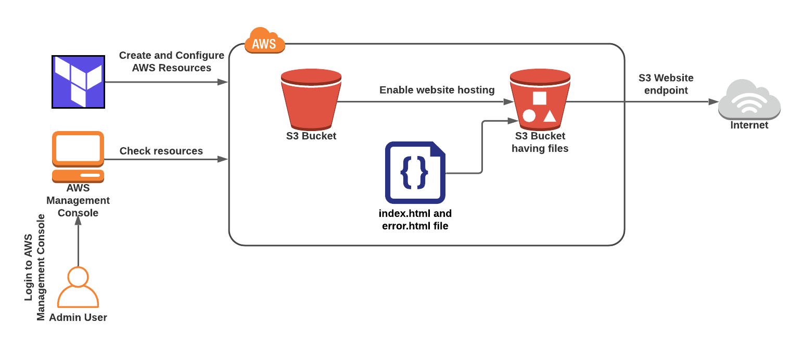

# terraform-static-website
S3 Bucket Static Website Deployment with Terraform
This project sets up an Amazon S3 bucket for static website hosting using Terraform. It includes configuration for:
Creating an S3 bucket.
Uploading static website files (index.html and error.html).
Configuring bucket ownership, public access settings, and website hosting.
Applying a bucket policy for public read access.
# Overview


# Features
Static Website Hosting: Serves index.html as the main page and error.html for error pages.
Public Access Configuration: Configures the bucket to allow public read access using a bucket policy.
Infrastructure as Code (IaC): Uses Terraform to manage and provision the S3 bucket and its settings.
# Prerequisites
Terraform: Installed and configured. Install Terraform
AWS Account: With programmatic access credentials set up.
IAM User Permissions: Ensure the IAM user has the following permissions:
- s3:CreateBucket
- s3:PutBucketPolicy
- s3:PutObject
- s3:GetObject
# Usage
1. Clone the Repository
```
git clone https://github.com/your-username/your-repo.git
cd your-repo
```
# 2. Update Variables
Update the variables.tf file with your bucket name and any other required inputs.
```
variable "bucketname" {
  default = "your-bucket-name"
}
```
#3. Initialize Terraform
Initialize Terraform to download the required provider plugins.
```
terraform init
```

# 4. Plan the Infrastructure
Review the changes Terraform will make to your infrastructure.
```
terraform plan
```
# 5. Apply the Configuration
Deploy the S3 bucket and its settings.
```
terraform apply
```
# 6. Access the Website
Once deployed, you can access your static website using the S3 public URL:
```
http://<bucket-name>.s3-website-<region>.amazonaws.com
```
# File Structure
```
├── main.tf                 # Main Terraform configuration file
├── variables.tf            # Variable definitions
├── index.html              # Static HTML main page
├── error.html              # Static HTML error page
├── README.md               # Project documentation
```
# Notes
Ensure the S3 bucket name is globally unique.
Use appropriate permissions for sensitive AWS credentials.
Be cautious when enabling public access for S3 buckets in a production environment.
# Cleanup
To destroy the resources created by this project:

```
terraform destroy
```